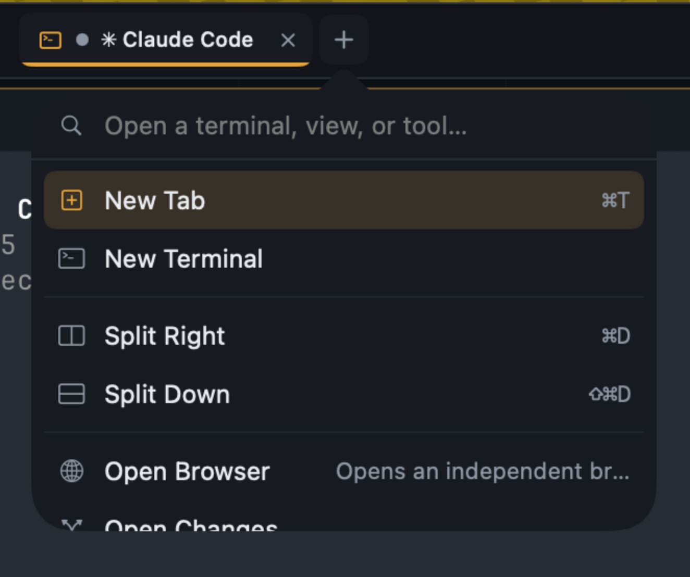

# T-039: Tab context menu — split options into the same tab
> Right-clicking a tab shows a context menu of openable options (terminal, browser, changes, …); choosing one splits inside that tab and places the new pane there.

- **priority**: medium
- **effort**: M
- **decision**: **(a) placement is a parameter** — taken 09:5x by session 247281cf, reasoning below

## Owner / files (agent lock)
session 247281cf — investigated 09:5x, **LOCK RELEASED, no file changed**. Nothing was built,
so `LauncherMenu.swift`, `ShellTitleBar.swift`, `PaletteIntentInvoker.swift` and the boundary
doc are all free.

## Investigation (session 247281cf, 09:5x) — the criteria contain a contradiction

Criterion 5 says classify before implementing, so I traced the launcher first. What I found
changes the shape of the task, so nothing was built.

**The item source is exactly where the task expects.** `host.commandIndex.launcherOnly` is
the `+` menu's list — the commands plugins declared with `palette.launcher`. Ten entries
today, matching criterion 2's list verbatim:

| Command | Provider | What its handler does |
|---|---|---|
| New Tab, New Terminal, Open Changes, Open Docs | core-commands | `workspace.tab.create.v1` |
| Split Right, Split Down | core-commands | splits the **focused** pane |
| Open Browser, Files: Open, Open Claude Sessions, Kanban: Open Board | four plugins | `workspace.tab.create.v1` |

**The placement mechanism criterion 3 wants already exists.**
`workspace.content.open.v1`'s own contract reads: *"Opens content in the tab identified by
invocation scope, reusing the pane that already shows this kind of content and otherwise
splitting a pane. Placement is host policy and never opens a tab."* That is criterion 3,
built and shipped.

**But the launcher's commands do not use it, and cannot be made to from the host side.**
Each command decides its own placement *inside the plugin's handler*. A menu that reuses
the list verbatim therefore cannot change where the result lands. Two facts follow:

1. **There is no scoped invocation path.** `PaletteIntentInvoker.send(commandID:host:runtime:)`
   takes no scope; the scope comes from the runtime's provider, which means the focused
   pane. Invoking "against the clicked tab" is not currently expressible. This is a real
   seam gap and is squarely inside this task.
2. **Six of the ten entries would still open a tab.** Everything built on
   `workspace.tab.create.v1` creates a tab by construction. Making them split means those
   plugins switch to `workspace.content.open.v1` — and that changes what they do **from the
   palette and the `+` launcher too**, not only from this new menu. That is a visible
   product behaviour change beyond this card's stated scope.

**Why I did not just pick one.** Criterion 2 (same targets, one shared source of truth) and
criterion 3 (splits inside the clicked tab, never a new tab) can both hold only if placement
becomes a parameter of the action. Doing that silently would either make
`workspace.tab.create.v1` sometimes not create a tab — a verb whose name lies, which the
boundary law's whole point is to prevent — or change four shipped plugins' behaviour on
surfaces this card never mentions. Both are decisions, not implementation details.

## Decision: (a) placement is a parameter

Taken here rather than escalated — the repo already contains everything needed to choose.

View openers move from `workspace.tab.create.v1` to `workspace.content.open.v1`. "Open
Browser" then lands as a pane in the current tab everywhere — palette, `+` launcher, and
this menu — and only "New Tab" still opens a tab.

**Why, in order of weight:**

1. **The host already owns a placement policy, and the openers bypass it.**
   `workspace.content.open.v1` reads: *"reusing the pane that already shows this kind of
   content and otherwise splitting a pane. Placement is host policy and never opens a tab."*
   That policy exists and nothing routes through it. Ten commands each deciding placement
   privately is the second implementation invariant 6 forbids; this is not a new design so
   much as connecting one that was already built.
2. **A tab per view fights the product.** T-029 built an entire attention system — dots,
   bold counts, a title-bar badge — whose premise is that a human watches *several panes at
   once* and needs to know which one wants them. One view per tab shows one at a time.
   VISION calls Tenon a supervision layer for parallel work; placement should default to
   "beside", not "elsewhere".
3. **No verb has to lie.** The alternative — teaching `workspace.tab.create.v1` to sometimes
   not create a tab — buys the same behaviour by breaking the naming discipline the boundary
   law exists to keep.
4. **The behaviour-change objection is weak here.** `CLAUDE.md`: pre-alpha, greenfield,
   *"backwards compatibility is not a priority"*. Trading a considered design against
   muscle memory nobody has yet is the wrong trade.

**What this does not change.** "New Tab" still opens a tab; a human who wants a tab asks for
one. Placement stays host policy, so the rule lives in one place and the plugins simply stop
asserting an opinion they had no business having.

## Criteria
- [x] Right-click on a tab chip opens a context menu — SwiftUI `.contextMenu` on `TabChip`,
      which is a native NSMenu on macOS; no second overlay style beside the `+` popover
- [x] Same targets as the `+` launcher, one shared source — both read
      `host.commandIndex.launcherOnly`; the menu adds no list of its own, so a plugin
      declaring a new creation verb appears in both without another edit
- [x] Choosing an option places the result **inside the clicked tab** — the scope names that
      tab's own pane, and placement is `workspace.content.open.v1`'s host policy (reuse a
      pane already showing this kind of content, otherwise split, never open a tab). The
      four view openers now ask for content instead of a tab, which is the decision above
- [x] Works on a background tab without stealing selection unless the action needs showing —
      `TabContextPlacement.requiresRevealing` returns false for a command that places
      nothing and for a tab already in front
- [x] Classified before implementation — the walk is above, written before any code, and
      `docs/architecture-interaction-boundaries.md` gains a DIRECT-inventory entry saying
      what is DIRECT (menu sourcing, the pure placement rule), what stays CONTRIBUTION
      (plugin entries), and that placement itself is **not** decided here
- [x] Headless tests for sourcing and target resolution — `TabContextPlacementTests`, 4
      cases, no window

## What landed

`TenonCore.TabContextPlacement` is the whole new rule and it is pure: given a catalog and a
tab, which pane should scope name, which workspace owns it, and does choosing this have to
bring the tab forward. Everything else is wiring — `PaletteIntentInvoker` gains a scoped
overload (the unscoped one builds its scope from the selected workspace/pane, which is right
for a keyboard surface and wrong for a menu attached to one tab), and `TabChip` gains a
`.contextMenu` fed from the launcher's own index.

**The seam gap was smaller than the investigation feared.**
`AppIntentRuntime.send(_:input:as:scope:…)` already existed, documented as the entry point
where "authority is visible at the call site rather than inherited from mutable UI state" —
exactly this case. Only `PaletteIntentInvoker` lacked the overload. The gesture is still
minted at the click, not accepted from the caller.

## Mutation proofs

| # | Mutation | Test đỏ |
|---|---|---|
| M24 | scoped pane returns the focused pane instead of the clicked tab's own | `testTheScopedPaneIsTheClickedTabsOwnActivePaneNotTheFocusedOne` |
| M25 | an unknown tab silently falls back to the focused pane | `testAnUnknownTabResolvesToNothingRatherThanToTheFocusedPane` |
| M26 | every command reveals the tab, even one that places nothing | `testOnlyAPlacingCommandBringsABackgroundTabForward` |

`cmp` confirms byte-identical restore after each.

**A fourth proof arrived unasked.** Switching the browser opener's verb turned
`BrowserPluginTests.testOwnedPaletteIntentOpensTheBrowserViewThroughWorkspaceIntent` red on
its own — it pinned `workspace.tab.create.v1` by name. That is the existing suite catching
the behaviour change this decision makes, which is what it is for; the assertion was updated
to the new verb with the reason recorded beside it.

## Still owed

Human-verify: the menu's pixels and the actual right-click, including on a background tab.
`swift build` exit 0 (warnings-as-errors), full `swift test` **864 / 0** (860 before).

## Notes
- Screenshot shows the existing + launcher menu; the tab context menu should surface the same catalog of openables, but with "put it in *this* tab as a split" semantics instead of "new tab".
- Split Right / Split Down already exist as commands (⌘D / ⇧⌘D) — the new part is targeting the *clicked* tab rather than the focused pane.
- Likely reuses the launcher's command aggregation (T-022 `palette.launcher` / LauncherMenu) as the item source.
